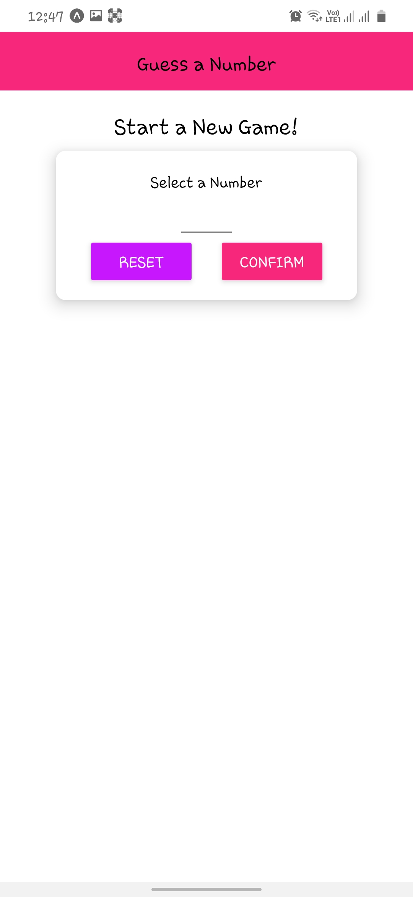
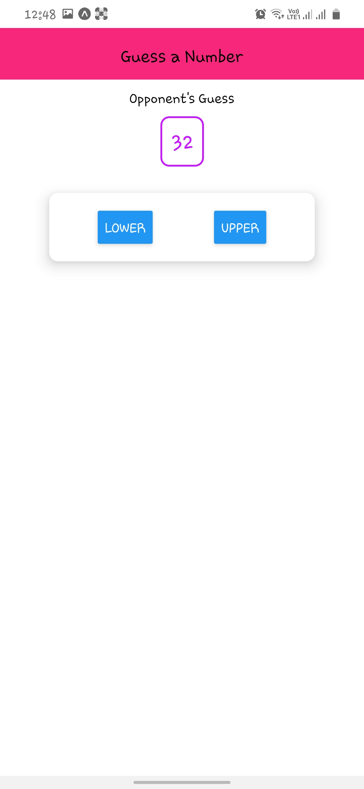
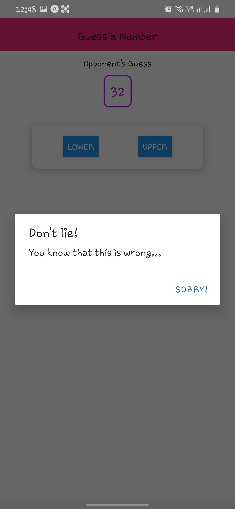
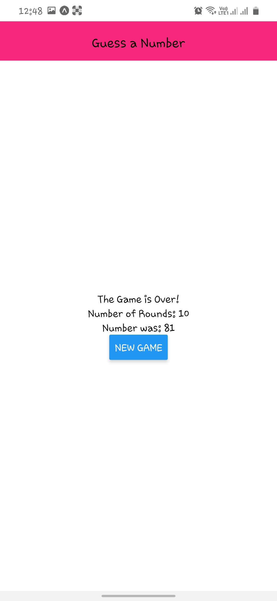

# GuessNumber Game
### NumberGuessing Game App made using React Native. It is one of my first application I have build while learning react native .

#### Functionality App has Right Now:-
<ul>
<li>Select A number</li>
<li>Start game</li>
<li>Guessing number Lower or Upper</li>
<li>Getting alert while giving wrong guess</li>
<li>Finish game on guessing correct numer</li>
<li>Show score and ask for new game</li>
</ul>

### NOTE:- Working on making project more UI friendly 😊.

